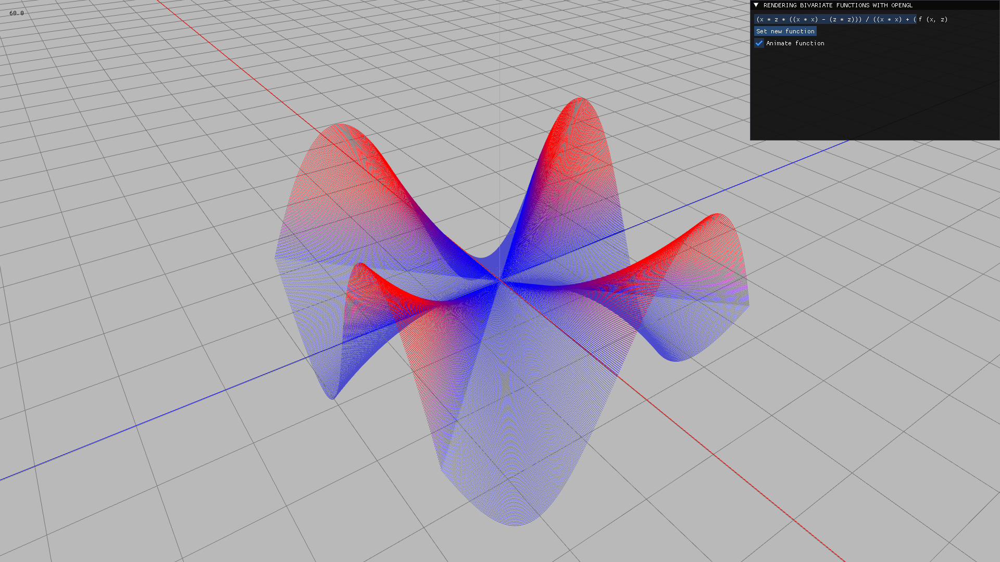
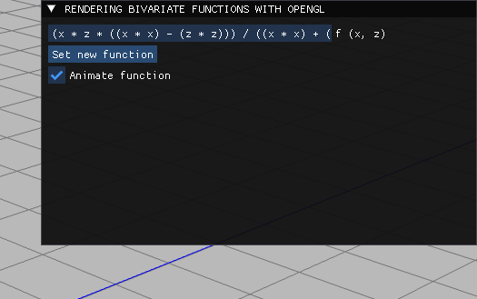
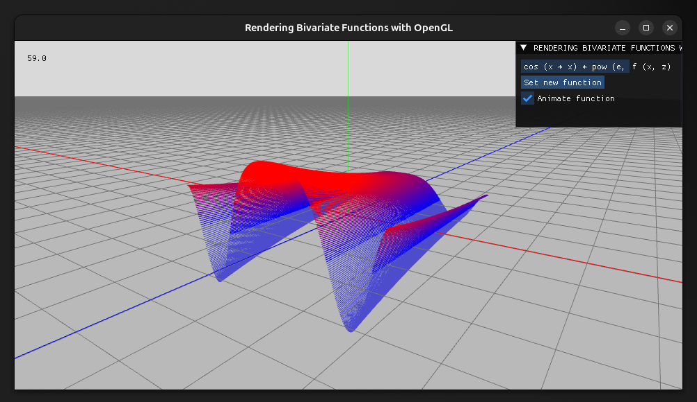

# Rendering Bivariate Functions with OpenGL

### To install minimum required dependencies (Debian):

```bash
sudo apt install libglfw3-dev
```
### To manually compile the project (G++):

```bash
g++ src/main.cpp include/glad/glad.c shaders/Shader.cpp utils/glfw.cpp utils/camera.cpp model/world.cpp model/points.cpp model/private/Axis.cpp model/private/Grid.cpp model/private/Ground.cpp include/imgui/imgui.cpp include/imgui/imgui_draw.cpp include/imgui/imgui_tables.cpp include/imgui/imgui_widgets.cpp include/imgui/backends/imgui_impl_glfw.cpp include/imgui/backends/imgui_impl_opengl3.cpp -o main.exe -Iinclude -Iinclude/imgui -Iinclude/imgui/backends -Wall -Wextra -std=c++17 -lglfw -lGL -ldl
```

<div align="center">
    <br>
    
    
</div>